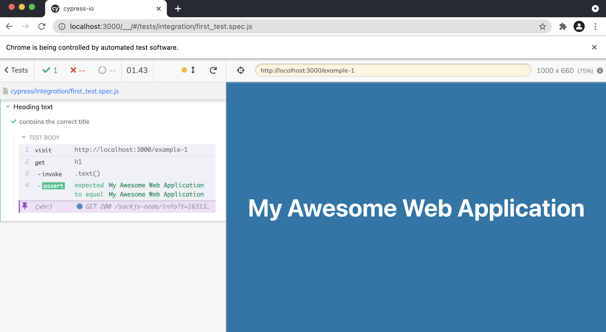
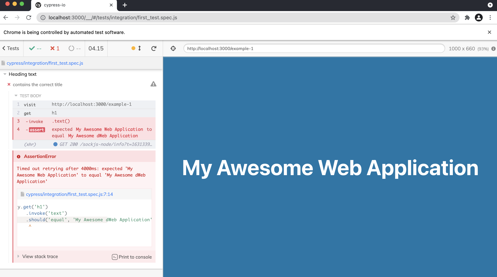

# Creating your first Cypress.io Tests

## Make sure to install npm and node
Install npm by using command
```npm install -g```
Make sure that npm is installed. Check version of the npm installed by  ```npm -v```
Make sure that node is installed. Check version of the node installed by ```node -v```

You're good to go to create your first cypress.io test. Follow the steps below:
1) ```npm init -y``` - initialize directory as npm package. It will generate package.json. This will output

Wrote to /Users/<your_user>/cypress.io/package.json:

{
  "name": "cypress.io",
  "version": "1.0.0",
  "description": "",
  "main": "index.js",
  "scripts": {
    "test": "echo \"Error: no test specified\" && exit 1"
  },
  "keywords": [],
  "author": "",
  "license": "ISC"
}

2) Install cypress ```npm install --save-dev cypress``` into a project to run in cypress
3) Open Cypress interface by running command ```npx cypress open```

## Create first tests
When creating your first tests you need a webpage in doing the validation.

Refer to target-app as you react application. Run ```npm run  start``` to build your npm modules. Npm modules serves as repository for your node.js dependencies.

For this first test we use example 1 of our react web application and  refer to ```first_test.spec.js``` as our refence for our first tests. 

1) Create an anonymous function for your test 
2) Define your actual tests. We use ```it``` as a anonymous function which contains are actual tests validation
3) Type ```cy``` which refers as our Cypress command
4) Navigate to page by ```cy.visit(url)```
5) Do the actual assertion for the page by validating the page title
  What does the code do:
    5.1) Cypress will find the ```h1``` element of the page
    5.2) Get the inner text from it 
    5.3) And validates if the text is equal to the expected value we input

## Run your tests in cypress

1) Open your cypress application by running ```npx cypress open```
2) This will  give our cypress window and navigate to our ```first_test.spec.js```
3) Click and run the tests


4) Validate if value inputted is invalid.
Cypress will only take few seconds to reload and exclude runtime and build time to any changes on the tests


## Create a test which input in 2 textboxes
1) Navigate to ```second_test.spec.js``` locates in cypress/integration folder
2) Reference react application will be example 3 of target-app react application
2) Explanation per tests are documented on the code
3) Once ready to validate the tests in cypress. Just run  command ```npx cypress open```

## Additional Notes
This code ```/// <reference types="Cypress"/>``` suggest intellisense to all Cypress commands which serves as a helper to all Cypress commands & documents link you might need.
Or the other way around is you can simply add ```jsconfig.json``` which provides same methodology on the code above.

## References
* [Cypress](https://www.cypress.io/)
* [Shaun Wassell Cypress Tutorial](https://www.linkedin.com/learning/end-to-end-javascript-testing-with-cypress-io)
